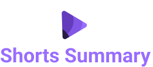
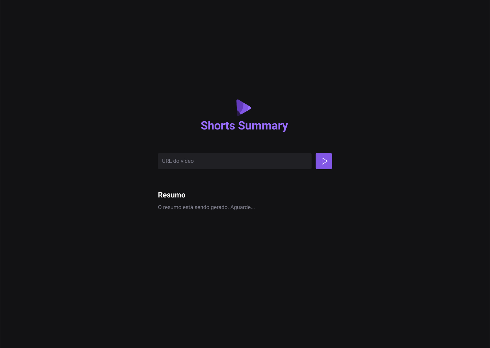

<p align="center">
  
</p>

---

<p align="center">
  <a href="#💻-sobre-projeto">Projeto</a>&nbsp;&nbsp;&nbsp;|&nbsp;&nbsp;&nbsp;
  <a href="#📎-passo-a-passo">Passo a passo</a>&nbsp;&nbsp;&nbsp;|&nbsp;&nbsp;&nbsp;
  <a href="#🎨-layout">Layout</a>&nbsp;&nbsp;&nbsp;|&nbsp;&nbsp;&nbsp;
  <a href="#🚀-como-executar-o-projeto">Executar o projeto</a>&nbsp;&nbsp;&nbsp;|&nbsp;&nbsp;&nbsp;
  <a href="#🛠-links-uteis">Links úteis</a>&nbsp;&nbsp;&nbsp;|&nbsp;&nbsp;&nbsp;
  <a href="#-author">Author</a>&nbsp;&nbsp;&nbsp;|&nbsp;&nbsp;&nbsp;
</p>

<h2  align="center">


[](./LICENSE)

</h2><br>

</p>

<br>

## 💻 Sobre o projeto

Projeto desenvolvido na **NLW IA - Trilha Foundation** oferecido pela [Rocketseat](https://www.rocketseat.com.br/).

<br>

## 📎 Passo a passo

📌  Aula 01
- Preparação do ambiente
- Criação do frontend da aplicação

📌  Aula 02
- Criação do backend da aplicação
- Criação e teste da rota de download


<br>

## 🎨 Layout

<p align="center">
  
</p>

<br>

## 🚀 Como executar o projeto

> 💡 O Frontend precisa que o Backend esteja sendo executado para funcionar.

<br>

```bash

# Clone este repositório
$ git clone git@github.com:nlnadialigia/nlw-ia-foundation.git

# Acesse a pasta do projeto no terminal/cmd
$ cd nlw-ia-foundation

# Instale as dependências
$ pnpm install

# Executar o backend (server)
$ pnpm run server

# O servidor inciará na porta:3333 - acesse http://localhost:3333

# Executar o frontend (web)
$ pnpm run web

# # A aplicação será aberta na porta:5173 - acesse http://localhost:5173

``` 

<br>

## 🛠 Links úteis

- [Figma](https://www.figma.com/)
- [Vite](https://vitejs.dev/)
- [Phosphor](https://phosphoricons.com/)
- [Axios](https://axios-http.com/ptbr/)
- [Node](https://nodejs.org/pt-br)
- [Express](https://expressjs.com/)
- [Cors](https://www.npmjs.com/package/cors)
- [Ytdl-core](https://www.npmjs.com/package/ytdl-core)


<br>

## 👩‍💼 Autora


&nbsp;&nbsp;&nbsp;&nbsp;&nbsp;&nbsp;&nbsp;&nbsp;&nbsp;&nbsp;[](https://www.linkedin.com/in/nlnadialigia)&nbsp;&nbsp;
[](mailto:nlnadialigia@gmail.com)&nbsp;&nbsp;
[](https://www.nlnadialigia.com)

---